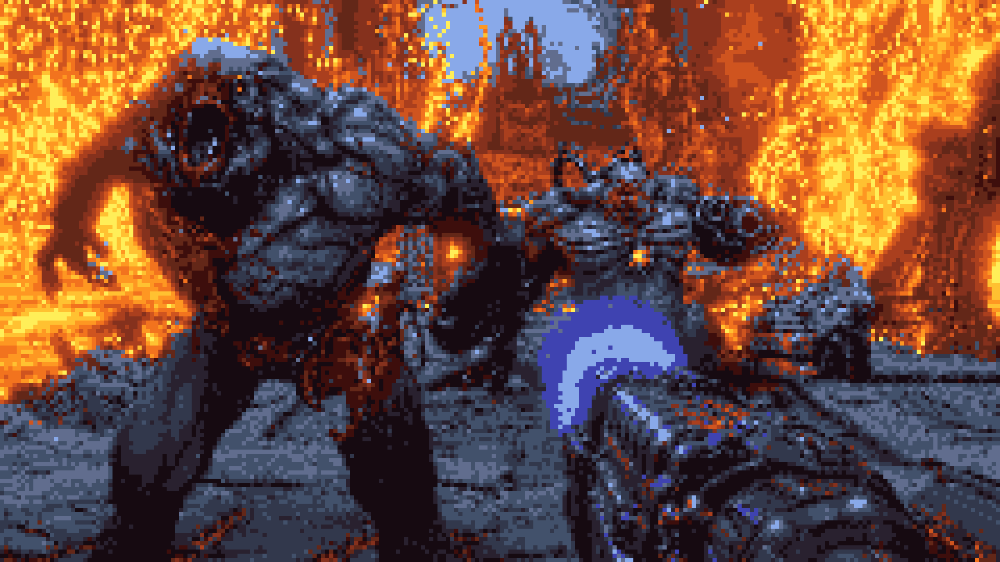
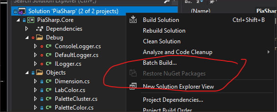

# PiaSharp
[TOC]



**Pixelated Image Abstraction Implementation in .NET 5.0 and C#.** 

The original algorithm was proposed by Timothy Gerstner in the 2012 paper, [**Pixelated Image Abstraction**]([Pixelated Image Abstraction (princeton.edu)](https://gfx.cs.princeton.edu/gfx/pubs/Gerstner_2012_PIA/Gerstner_2012_PIA_small.pdf)).

This is an implementation of that paper.


## Execution Environment

The operating system required to run this program is **Windows 10** with the .NET 5.0 framework. Details on how to download that is in the next section.


## Development Environment

**PiaSharp** requires a **Windows 10** computer. Due to licensing issues with Emgu CV, **Macintosh is** **not supported**.

You will need the following to properly build and run the project:

* Visual Studio Community 2019 - [Download Visual Studio 2019 for Windows & Mac (microsoft.com)](https://visualstudio.microsoft.com/downloads/)
* .NET Framework 5.0 (SDK) - [Download .NET 5.0 (Linux, macOS, and Windows) (microsoft.com)](https://dotnet.microsoft.com/download/dotnet/5.0)


## Running the Release

If you want to skip building the project and go straight into running the program, you can download the release here:

[Release Release Build · urbanspr1nter/piasharp (github.com)](https://github.com/urbanspr1nter/piasharp/releases/tag/release-2)

Simply run `PiaSharp.Driver.exe` and the `params.json` file will be loaded. No additional runtime arguments are needed.

See the next section on how you can customize this run with your own images.


## params.json

This release build is ready to run, and can be started by modifying the `params.json` to include your own images and configuration. Each object in the `params.json` file is designed to be a "job". The array itself is a batch of jobs.

```
[
	{
		...job1
    },
    {
    	...job2
    },
    ...,
    {
    	...jobN
    }
]
```

Jobs themselves have a few parameters. Here is an example job defined in `params.json`:

```
{
    "Skip": true,
    "File": "inputs/doom.png",
    "OutputWidth": 240,
    "OutputHeight": 135,
    "TotalColors": 16,
    "OutputFile": "doom_output.png",
    "Debug": true
}
```

* `Skip` - Tells the program to skip the job, or process it. `true` indicates skip.
* `File` - Is the relative path to the input file.
* `OutputWidth` - Is the length of the output in pixels.
* `OutputHeight` - Is the height of the output in pixels.
* `TotalColors` - The total number of colors which the output should contain
* `OutputFile` - The relative path to the output file which should be created
* `Debug` - Output verbose logging in console, and all intermediate images generated from each iteration
  * ❗ Warning ❗ - Turning on this option can be slow!


**A few points**

* Attempting to create output images with more than 16 colors can take a long time. Recommended to generate images that are 4-16 colors in depth.
* The program is designed to be self healing, so if the job is taking 


## Building the Project

Open the solution file, `PiaSharp.sln` in Visual Studio, you can restore all the packages by right clicking on the solution and choosing **Restore NuGet Packages**.



Then just click on **Build Solution** in Visual Studio under using the menu path: `Build -> Build Solution`.


## Contact Me

Questions, feedbacks, comments, etc. 

Please email: urbanspr1nter@gmail.com , or visit my personal webpage: https://rogerngo.com/notebook/

